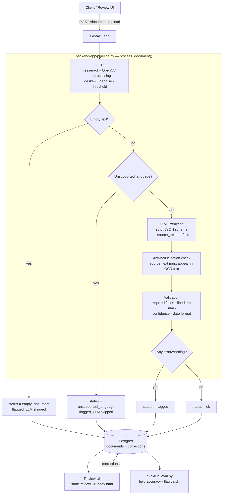

# Architecture

## System diagram

## Why these choices

### 1. Tesseract (open-source OCR) instead of a cloud OCR API

**Choice:** Tesseract + PIL/numpy preprocessing (grayscale, contrast stretch, a projection-profile deskew search), run locally in the container.

**Why:** For an MVP/portfolio project processing typed or clean scanned invoices, Tesseract with basic preprocessing gets close to cloud-API accuracy at zero marginal cost and zero external dependency — which matters for a `docker compose up` demo that has to work from a clean clone without anyone provisioning cloud credentials. It also keeps document images fully local, which is a real consideration for financial documents.

**Trade-off:** Cloud OCR (Textract, Google Document AI, Azure Form Recognizer) meaningfully outperforms Tesseract on messy phone-camera photos, handwriting, and low-quality scans, and several of them return layout/table structure that would remove the need for the LLM to reconstruct line items from flat text. The OCR module is isolated behind a single `run_ocr()` function specifically so swapping in a cloud provider later is a contained change, not a rewrite — that's the concrete reason `ocr.py` doesn't leak Tesseract-specific types into the rest of the pipeline.

**A revision worth calling out:** preprocessing originally used OpenCV (`cv2.adaptiveThreshold` + `minAreaRect`-based deskew). It was rewritten to pure PIL + numpy specifically to fit Render's free-tier 512MB RAM cap for the public deployment (`opencv-python-headless` alone is a 60-90MB import with a heavy resident footprint). The replacement deskew is a small projection-profile search: rotate a downsampled thumbnail across a ±10° sweep and keep the angle whose row-sum profile has the highest variance (text lines snap into sharp bands at the correct angle). Tested against the bundled rotated sample documents before shipping, it matched or beat the OpenCV version's accuracy — a case where the constraint (fit in 512MB) didn't cost the thing it was constraining (OCR quality), but that was verified empirically, not assumed. A first attempt at cutting the dependency — using Tesseract's own orientation-detection (OSD) pass instead of a numpy search — was tried and rejected: OSD only detects large 90/180/270° rotations, not the small few-degree skew real scans actually have, and it measurably lost text on the rotated test set.

### 2. Postgres instead of SQLite for the deployed service

**Choice:** SQLite is used for fast local dev/tests (`DATABASE_URL=sqlite:///...`, set automatically by `tests/conftest.py`) and for the free public Render deployment; `docker-compose.yml` runs Postgres for local full-stack development.

**Why:** The review UI is a concurrent write path (multiple reviewers correcting documents) sitting next to the upload/extraction write path. SQLite serializes writes at the file level, which is fine for a single test process but becomes a real bottleneck the moment more than one person uses the review queue at once. Postgres also gives a straightforward upgrade path to a JSONB column for `extracted_json` (currently plain `TEXT` for SQLite-compatibility) if the schema needs to be queried directly later, e.g. "show me every document where `total_amount.confidence < 0.5`."

**Trade-off:** Postgres is one more moving part in `docker-compose.yml` and one more thing that can fail to come up (mitigated here with a `healthcheck` + `depends_on: condition: service_healthy`). For a true single-user local demo, SQLite alone would have been simpler to set up. The free Render deployment (`render.yaml`) deliberately uses SQLite rather than adding a Postgres service: Render's free Postgres expires after 30 days and free web services have no persistent disk anyway, so the data resets on every restart regardless of which database is used — adding Postgres there would trade simplicity for a durability guarantee the free tier can't actually deliver.

### 3. Synchronous request/response instead of a task queue

**Choice:** `POST /documents/upload` runs OCR → LLM extraction → validation synchronously and returns the full result in one response.

**Why:** Processing one document takes a few seconds (OCR: sub-second; LLM call: 1-3s). For that latency, a synchronous request is simpler to build, simpler to test (no worker process, no polling endpoint, no job-status table), and simpler to reason about for this project's scope — the FastAPI test client can assert on the final result directly in `test_api.py` without any retry/poll loop.

**Trade-off:** This does not scale to batch uploads (100 invoices at once) or to LLM latency spikes, since every open HTTP connection holds a worker the whole time. The point at which I'd switch: once a single "upload a folder of invoices" use case shows up, or once p95 LLM latency regularly exceeds a few seconds, I'd move extraction behind a queue (Celery/RQ + Redis), turn `POST /documents/upload` into "accept + return 202 with a document id," and add a `GET /documents/{id}` polling/status flow — the schema in `db.py` already has a `status` column for exactly this reason, so the switch wouldn't require a data-model change, just a different producer for that column.

## Data flow for a single document

1. **Upload** — `routes/documents.py` validates content-type, size, and non-empty bytes before touching the pipeline (`app/config.py` holds those limits, not magic numbers in the route).
2. **OCR** — `app/ocr.py` preprocesses the image and runs Tesseract. If extracted text is below `OCR_MIN_CHARS`, the document short-circuits to `empty_document` — the LLM is never called, which matters for cost.
3. **Language check** — `langdetect` runs on the OCR text; if it disagrees with the configured `OCR_LANGUAGES`, the document short-circuits to `unsupported_language`.
4. **Extraction** — `app/extraction.py` prompts the LLM for a strict JSON schema where every field carries a `confidence` and a verbatim `source_text`. Malformed JSON gets one retry with an explicit correction prompt before failing as `extraction_failed`.
5. **Hallucination check** — every non-null field's `source_text` is checked against the raw OCR text (fuzzy match, to tolerate OCR noise). A field whose source can't be located is nulled out and its confidence zeroed, regardless of what the model claimed.
6. **Validation** — `app/validation.py` runs deterministic checks: required fields present, line items sum to the pre-tax subtotal within tolerance, per-field confidence above threshold, date parses. Each check returns a typed `ValidationIssue` (`error` or `warning`) with the specific field it concerns.
7. **Flagging** — any `error`, or (by default) any `warning`, sends the document to the human review queue.
8. **Persist** — the full result, including raw OCR text and the issue list, is stored so a reviewer never has to re-run anything to see why a document was flagged. The original uploaded file is also saved to disk (`UPLOAD_DIR`, a random filename to avoid collisions) and served back at `GET /documents/{id}/file`, so the review UI can show the source image next to the extracted fields instead of asking a reviewer to trust flattened OCR text alone.
9. **Review loop** — a human corrects flagged fields in `static/review_ui/index.html`; corrections are logged to the `corrections` table (append-only) and immediately overwrite the stored extraction with confidence `1.0`. `GET /documents/stats/corrections` aggregates corrections by field — a field that gets corrected disproportionately often is the concrete, data-backed signal for tightening its validation rule or confidence threshold.

## What I'd build next

- Swap the line-item/table extraction onto a cloud OCR provider's native table detection instead of asking the LLM to reconstruct rows from flat text — this is the single biggest accuracy lever for multi-line-item invoices.
- A confidence-calibration pass: log (predicted confidence, was-it-corrected) pairs from the `corrections` table and check whether "confidence 0.9" fields are actually right ~90% of the time. If not, the threshold in `LLM_FIELD_CONFIDENCE_THRESHOLD` is mis-set, and this is exactly the loop the corrections log exists to close.
- Batch upload + the async pipeline described in decision 3, once single-document latency stops being the bottleneck.
